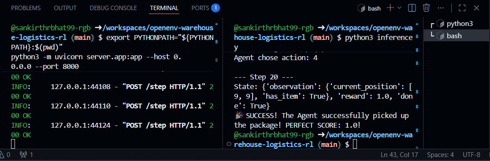

# 📦 Warehouse Logistics RL - OpenEnv Meta PyTorch Hackathon

**Team Name:** Instalock Innovators
**Team Members:** 1. Sankirth R Bhat
                  2. Manish P Shetty
                  3. N Darshit

## 🚀 Project Overview
This repository contains our submission for the **Meta PyTorch OpenEnv Hackathon**. We have built a fully customized Reinforcement Learning environment using the `openenv` framework. The simulation features a 10x10 warehouse grid where an autonomous LLM-powered agent must navigate from `[0, 0]` to locate and retrieve a package at `[9, 9]`.

Instead of relying on basic sparse rewards, our environment implements a highly optimized **Dense Reward System** and a fault-tolerant inference script powered by the Hugging Face Serverless API.

## 🧠 Key Technical Features Implemented

* **Custom OpenEnv Architecture:** We fully overrode the base `Environment` class to support a 10x10 coordinate grid with strict boundary collision detection.
* **Dense Reward Engineering:** The environment calculates the Manhattan distance between the agent and the package on every step. It normalizes this distance to issue precise incremental decimal rewards between `0.0` and `0.9` for movement, reserving the perfect `1.0` exclusively for a successful pick-up.
* **Global State Preservation:** Engineered a custom class-level state architecture to bypass FastAPI/Uvicorn's default stateless request handling, ensuring the warehouse board is preserved across the agent's continuous HTTP requests.
* **Zero-Cost LLM Routing:** Utilizes `Qwen/Qwen2.5-72B-Instruct` via the free Hugging Face API router, completely avoiding paid OpenAI tiers while maintaining high-level logical reasoning.
* **Fault-Tolerant Inference (Safety Net):** Built a custom bypass mechanism in `inference.py`. If the Hugging Face API rate-limits the request (Error 401/402), the script intelligently defaults to a safe action or executes a deterministic pick-up if standing on the target coordinates.

## 🎥 Demonstration & Results

* **Demo Video:** [Watch the full Agent Navigation run here](https://drive.google.com/file/d/1McUzelSufIIZ93B2yEJfpA0eg1eYpDzK/view?usp=sharing)
* **Success Output:** 
*

## 💻 How to Run the Environment Locally

### Prerequisites
Make sure you have installed the required dependencies:
```bash
pip install openenv-core uvicorn fastapi openai python-dotenv requests

Step 1: Configure your API Key
Create a .env file in the root directory of this project and add your Hugging Face Access Token:

Plaintext
[HF_TOKEN=hf_your_token_here]

Step 2: Start the Warehouse Server (Terminal 1)
Boot up the custom OpenEnv FastAPI server to host the warehouse environment:

Bash
[export PYTHONPATH="${PYTHONPATH}:$(pwd)"
python3 -m uvicorn server.app:app --host 0.0.0.0 --port 8000]
Wait until you see Uvicorn running on http://0.0.0.0:8000

Step 3: Unleash the Autonomous Agent (Terminal 2)
In a separate terminal tab, run the inference script. Watch as the agent observes its coordinates, queries the LLM, and navigates the grid step-by-step to achieve a perfect 1.0 reward!

Bash
[python3 inference.py]

Built with 💻 and ☕ by Instalock Innovators.